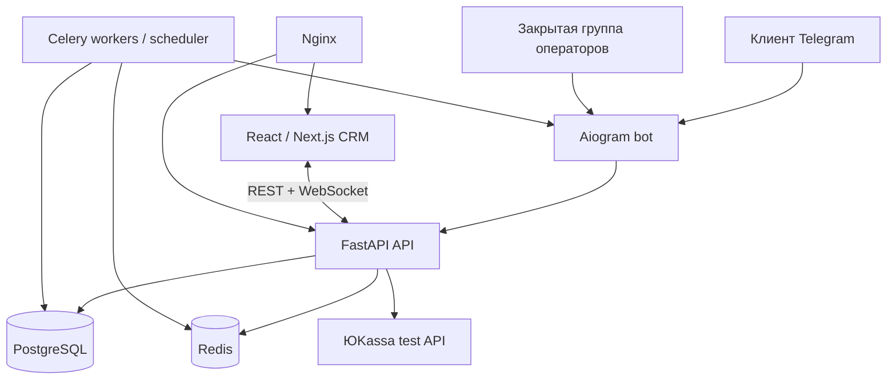

# Production-проект Telegram-магазина одежды — дизайн

**Дата:** 2026-08-15  
**Статус:** согласован для планирования  
**Цель:** создать Telegram-магазин одежды с CRM-админ-панелью, двусторонней поддержкой, заказами, складом, оплатой и маркетингом.

## Границы проекта

Система реализует весь функциональный объём исходного ТЗ: каталог и варианты товаров, корзину и оплату, складской учёт, заказы, CRM, поддержку, рассылки, промокоды, скидки, возвраты, аналитику, роли, аудит, уведомления и резервное копирование.

Первое развёртывание выполняется локально на ПК пользователя через Docker Compose. Архитектура и конфигурация должны позволять последующее размещение на сервере без переработки приложения. Оплата подключается через ЮKassa в тестовом режиме. Административные Telegram-уведомления и ответы выполняются в закрытой группе операторов. Веб-админка использует вход по логину и паролю с ролевым доступом.

## Выбранная архитектура

Используется модульный монолит в одном репозитории с независимыми контейнерами:

- `backend`: Python 3.12, FastAPI, REST API, WebSocket, доменная логика, RBAC и аудит;
- `bot`: Aiogram 3, Telegram-интерфейс покупателей и обработчик административной группы;
- `admin-web`: React/Next.js, адаптивная CRM-панель;
- `worker`: Celery и Celery Beat для фоновых задач, рассылок, резервов, уведомлений и бэкапов;
- `postgres`: единственный источник коммерческих данных;
- `redis`: broker Celery, кэш, pub/sub и служебные блокировки;
- `nginx`: локальный reverse proxy, статические файлы и production-ready точка TLS;
- `yookassa`: внешний тестовый платёжный API.

Bot и CRM не обращаются к базе данных напрямую. Их единственный контракт — API и доменные события backend. Такое разделение позволит добавить Telegram Mini App как дополнительный клиент тех же API каталогов, корзины и заказов.

## Модули и модель данных

| Модуль | Сущности |
| --- | --- |
| Каталог и склад | `categories`, `collections`, `products`, `product_variants`, `product_media`, `inventory_movements` |
| Покупатели | `customers`, `customer_addresses`, `favorites`, `customer_tags`, `admin_notes` |
| Корзина и заказ | `carts`, `cart_items`, `orders`, `order_items`, `order_statuses`, `payments`, `deliveries`, `stock_reservations` |
| Маркетинг | `promo_codes`, `promo_code_redemptions`, `discounts`, `mailings`, `automation_rules` |
| Поддержка | `conversations`, `messages`, `message_attachments`, `conversation_assignments` |
| Администрирование | `staff`, `roles`, `permissions`, `audit_logs`, `notifications`, `settings` |
| Возвраты | `return_requests`, `return_items`, `return_attachments` |

Вариант товара определяется сочетанием товара, цвета и размера. Остаток хранится и изменяется только у варианта. Нулевой вариант нельзя купить или добавить в заказ.

`order_items` содержат снимок названия, артикула, цены, скидки, варианта и количества на момент подтверждения. Редактирование товара не меняет исторические заказы.

Коммерческие данные удаляются мягко: товар архивируется, а история заказов, сообщений, оплат и аудита остаётся доступной.

## Заказ, склад и оплата

1. Покупатель выбирает вариант, добавляет его в корзину и оформляет заказ в боте.
2. Backend повторно валидирует цену, скидки, промокод, доставку и наличие.
3. В одной транзакции создаётся заказ и резерв остатков на 15 минут (значение изменяемо в настройках).
4. Backend создаёт платёж ЮKassa; пользователь завершает оплату на платёжной странице.
5. Webhook платёжного провайдера валидируется и обрабатывается идемпотентно.
6. Успешная оплата фиксирует списание резерва, меняет статус и отправляет уведомления. Неуспешный или просроченный платёж освобождает резерв.
7. Изменение статуса заказа вызывает шаблонное уведомление покупателю. Администратор может добавлять статусы и разрешённые переходы.

Интеграции оплаты и доставки реализуются через адаптеры. В первой поставке работает ЮKassa test; способы доставки настраиваются вручную, а СДЭК, Boxberry и Почта России подключаются позднее без изменения ядра заказа.

## Коммуникации и realtime

Каждое входящее сообщение клиента создаёт или переоткрывает связанный с ним `conversation`; при наличии заказа добавляется его ссылка. Сообщение, вложения, Telegram message ID, канал, автор и статус доставки сохраняются до публикации событий.

Новое сообщение одновременно:

1. появляется в CRM через WebSocket;
2. создаёт уведомление в панели;
3. зеркалируется в закрытой Telegram-группе операторов с `conversation_id`, клиентом и заказом;
4. при необходимости назначается ответственному сотруднику.

Оператор отвечает из CRM или с помощью callback-кнопки «Ответить» в группе. Backend всегда сверяет `conversation_id`, права и автора, после чего сохраняет сообщение и отправляет его покупателю только от имени бота. Свободный текст в группе не считается ответом клиенту. Это исключает ошибочную привязку ответа.

Поддерживаются текст, фото, видео, документы, голосовые, stickers (если Telegram API отдаёт их) и медиагруппы.

## Админ-панель

Панель имеет разделы: Dashboard, Заказы, Товары, Категории, Коллекции, Остатки, Клиенты, Чаты, Рассылки, Промокоды, Скидки, Возвраты, Аналитика, Сотрудники, Аудит и Настройки.

Ключевые интерфейсы:

- каталог с массовыми операциями, медиа, вариантами и остатками;
- заказ с таймлайном статусов, оплатой, доставкой и трек-номером;
- карточка клиента с заказами, корзиной, избранным, тегами, заметками и историей коммуникаций;
- двухпанельный чат: список диалогов слева, история и контекст клиента справа;
- конструктор рассылок и автоматизаций с сегментацией и статистикой;
- аналитика продаж, товаров, клиентов, размеров, цветов и складских рисков.

Интерфейс адаптивен для ПК, планшета и смартфона, поддерживает светлую и тёмную темы.

## Доступ, безопасность и аудит

Вход выполняется по логину и паролю. Пароли хешируются Argon2. Сессии используют короткоживущий access token и ротируемый refresh token в защищённых cookie. Для браузерных запросов применяются CSRF-защита и rate limiting.

Начальные роли: администратор, менеджер заказов, оператор поддержки и контент-менеджер. Права имеют вид `resource.action`, например `products.update`, `orders.update_status`, `conversations.reply`, поэтому администратор может создавать собственные роли.

На каждом endpoint и в доменной операции проверяются права. Входные данные валидируются Pydantic, доступ к медиа ограничивается whitelist типов и размеров, а все административные действия фиксируются в неизменяемом `audit_logs`.

Секреты, токен Telegram, ключи ЮKassa и пароли БД находятся только в `.env`; в репозитории есть `.env.example`. Webhook использует секретный путь и дополнительную проверку подписи/идентификатора события.

## Фоновые задачи и эксплуатация

Celery выполняет рассылки, автоматические сообщения, истечение резервов, повторные отправки, обработку медиа, уведомления об остатках и расписание бэкапов. Задачи имеют идемпотентные ключи и ограниченные повторные попытки.

Docker Compose содержит профили `dev` и `production`, health checks и команды для запуска, миграций, тестовых данных, логов и резервного копирования. PostgreSQL резервируется ежедневно с хранением семи последних архивов; вручную запустить backup можно из панели.

## Порядок реализации

1. Инфраструктура Docker, конфигурация, FastAPI, миграции, идентификация, RBAC и аудит.
2. Каталог, варианты, медиа, остатки, CRM-управление товарами.
3. Bot, корзина, checkout, промокоды, резервы и ЮKassa test.
4. Заказы, уведомления, клиенты и административная CRM.
5. Realtime-чат, Telegram-группа операторов и вложения.
6. Рассылки, автоматизации, скидки, возвраты, аналитика и бэкапы.
7. Нагрузочные, интеграционные и e2e-тесты, hardening, документация эксплуатации.

## Критерии приёмки

- Покупатель оформляет и оплачивает заказ в Telegram, а склад учитывает вариант товара корректно.
- Заказ и оплата появляются в CRM, а клиент и операторы получают уведомления.
- Сотрудник меняет статусы в рамках прав; история и уведомления сохраняются.
- Сообщения покупателя появляются в CRM и Telegram-группе почти в реальном времени; ответы с обоих каналов приходят клиенту от бота и сохраняются в одной истории.
- Управление товарами, клиентами, ролями, промокодами и рассылками не требует изменения кода.
- Все чувствительные операции, интеграции, бэкапы и восстановление переживают перезапуск контейнеров.
